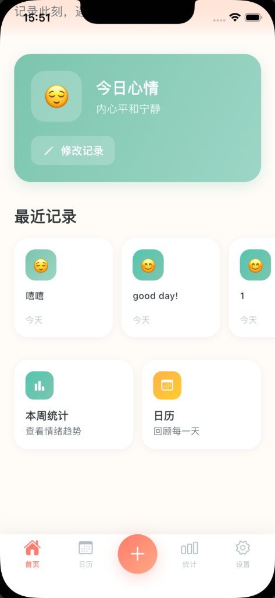
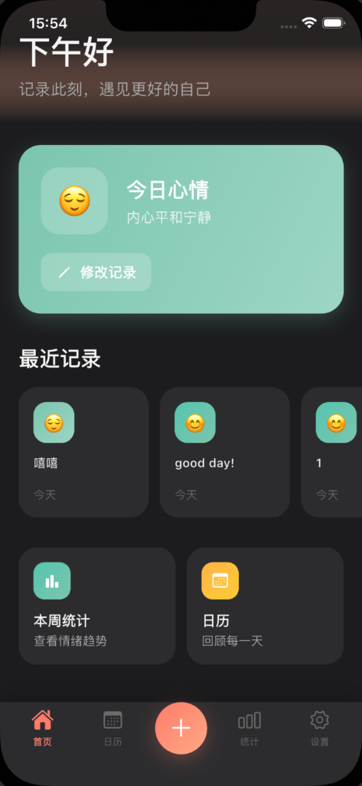
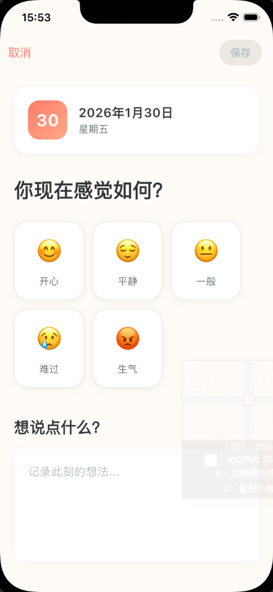
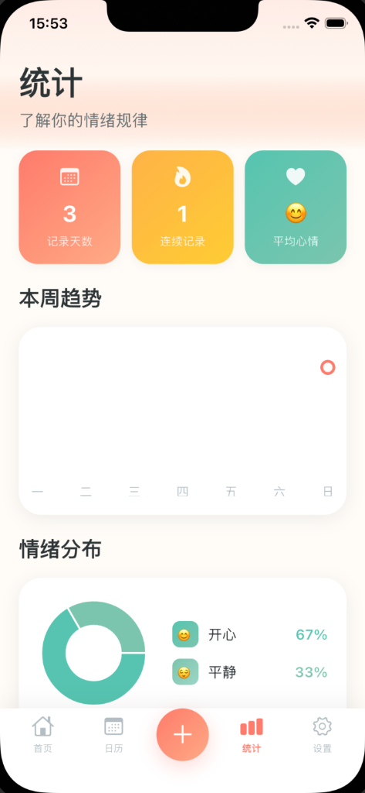
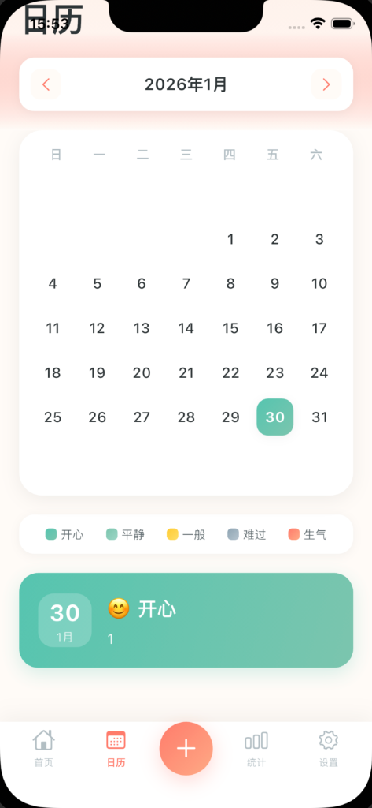
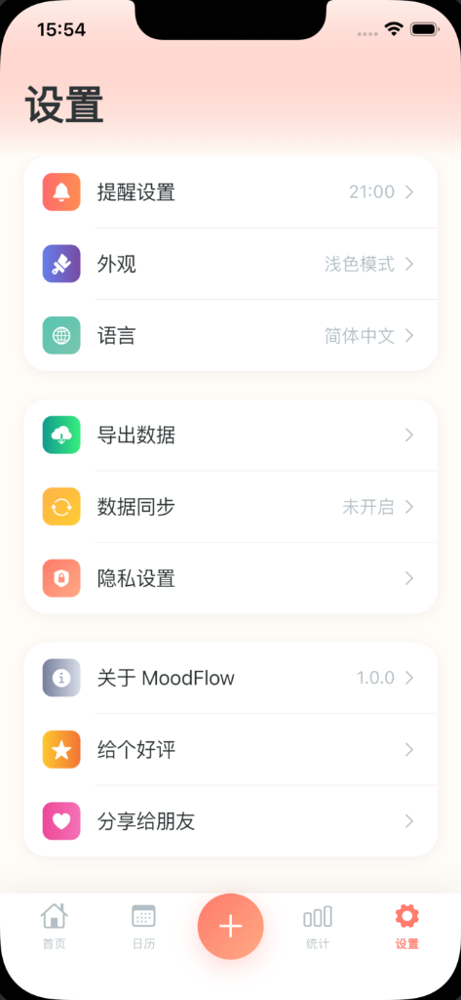
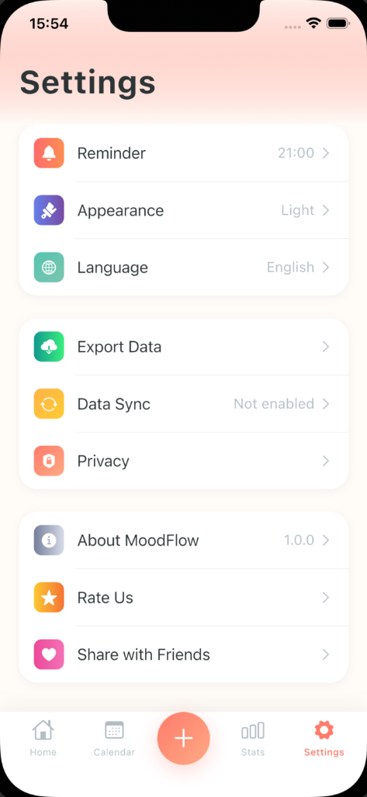

# MoodFlow

A healing mood diary app built with Flutter. Track your emotions, visualize trends, and build healthier habits — in a beautifully crafted Apple Design interface.

<p align="center">
  
  
  
  
</p>

## Features

- 📊 **Emotion Analytics** — Trend charts & ring charts to visualize your mood patterns over time
- 📅 **Mood Calendar** — Gradient-colored daily mood tracking at a glance
- 🎨 **Apple Design** — Coral-warm color palette (#FF7B6B), generous whitespace, rounded cards
- 🌙 **Dark Mode** — Full dark theme support, follows system or manual toggle
- 🌐 **i18n** — Complete Chinese & English localization
- 🔒 **Privacy First** — All data stored locally on device, no cloud sync required
- ✨ **Smooth Animations** — Dynamic mood picker with selection animations

## Screenshots

| Home (Light) | Home (Dark) | Record | Calendar | Stats |
|:---:|:---:|:---:|:---:|:---:|
|  |  |  |  |  |

| Settings (中文) | Settings (EN) |
|:---:|:---:|
|  |  |

## Tech Stack

| Layer | Technology |
|-------|-----------|
| Framework | Flutter 3.x |
| State Management | Riverpod |
| Local Storage | Hive |
| Charts | fl_chart |
| Routing | go_router |
| Settings | SharedPreferences |

## Getting Started

```bash
# Clone the repo
git clone https://github.com/minov9/MoodFlow.git
cd MoodFlow

# Install dependencies
flutter pub get

# Run the app
flutter run
```

## Design

- **Primary Color**: Coral Pink `#FF7B6B`
- **Background**: Warm White `#FFFBF7`
- **Dark Mode**: Deep Black `#121212` + Card Grey `#1E1E1E`
- **Card Radius**: 20-24px with soft shadows
- **Mood Colors**: Teal, Mint, Warm Yellow, Blue Grey, Coral Red

## License

MIT
